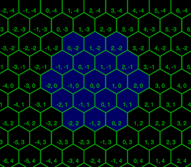
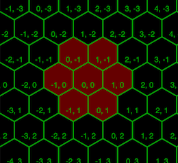
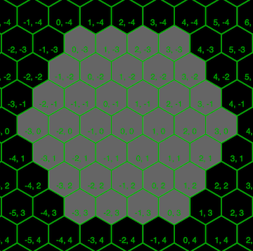

# Space Tyckiting

## Introduction

In *Space Tyckiting* you are tasked to create an AI that commands a group of bots, which are pitted against other AI controlled bots. Use cunning, clever tactics and strategy to beat your opponents. Two AI's enter, one AI leaves.

## Creating the AI

Creation of AI starts with choosing programming language. There are
ready made skeletons for following programming languages:

* Clojure
* Haskell
* JavaScript
* Rust
* Scala
* F#
* Swift
* Python
* Ruby (unfinished)

## Running your bot

In order to run your bots, you need a running server and running opponents. During development phase you can download the server code from:
https://github.com/futurice/space-tyckiting/server

Clients are located at:
https://github.com/futurice/space-tyckiting/clients

*NOTE* you need to have Node.JS installed

```
npm install

node start-server.js
```

After server is running, you can follow the progress of the game with your favorite web browser at http://localhost:3000

The javascript-client contains couple simple opponents that can be launched with commands
```
node cli.js

node cli.js --ai=mastermind
```

Each of the ready-made clients contains information on how to run those.

## Game description

### Overview
The game is run in turns. During a turn each team registers actions for each of their bots. The actions are resolved, the results returned back to teams. If there's only one team with surviving bots, that team is declared the winner and game ends. The game can also end after defined amount of rounds is reached.

At the beginning of game bots will not know the location of each other. In order to locate another bots, your bots can use RADAR-action to locate your opponent. Another bots will also see each other's if those are close to each other. After locating your opponents, you can use CANNON-action to attack the bot. Using MOVE-action you can try to evade being destroyed.

The game is played on the hexagonal grid. All positions are in pointy-tipped axial coordinates.

For the reference read [from Red Blob Games](http://www.redblobgames.com/grids/hexagons/).

### Game turn

0. Each bot connects to server.
1. Each team sends `join`
2. After required amount of teams have joined, the game starts
3. Loop until the number of living teams is less than or equal to 1
    * Each team sends its bots actions. Team have maximum of *300ms* to respond or their message is considered a `skip`
    * Server sends `events` to each team.
4. Server broadcasts `end`

### Actions

* **Move** 0-2 hexes.

    

* **Cannon** point *(x, y)*. By default an exact hit will cause *-2 HP*  and a hit to a neighbouring cell will cause *-1 HP*. The radius of blast is 1 hex.

    

* **Radar** an area centered at point *(x, y)*. Radaring reveals players 3 hex away from the center.

    

The resolution order of actions is as following:

* `Move`-actions:
    All bot movements are resolved simultaneously. **NOTE:** After moving, bots can be on top of each other.
* `Radar`-actions
	All radar actions are resolved simultaneously. **NOTE:** The bot may be destroyed during next phase.
* `Cannon`-actions
	All cannon actions are resolved simultaneously. Bots are destroyed after this step (it can shoot before it's destroyed)

**NOTE:** Bots can also be detected by being close enough to other bots. This is called seeing and default see-radius is 2 hexes. Seeing happens at same phase as radaring.

### Events

In response to actions each team receives an events-message that can contain any number of any of the following events:

* `hit` A bot has been hit. This might mean that you have been hit, or you hit another bot.

* `die` A bot has died. This might mean that you died, or that you killed another bot.

* `radarEcho` Results from radaring bots. You will never be included in this event.

* `see` When bots are close to each other, they can detect the other bot.

* `detected` You will be notified that you have been seen or radared.

* `damaged` Your bot was damaged

* `move` Your or one of your team bots new position after move action. Cannot move out of map.

* `noaction` Bot made now actions.

* `end` Game has ended. Game ends when there's only one team with non-destroyed bots or if the maximum number of rounds has been reached.

For more detailed information on different messages between clients [DETAILS](DETAILS.md)
